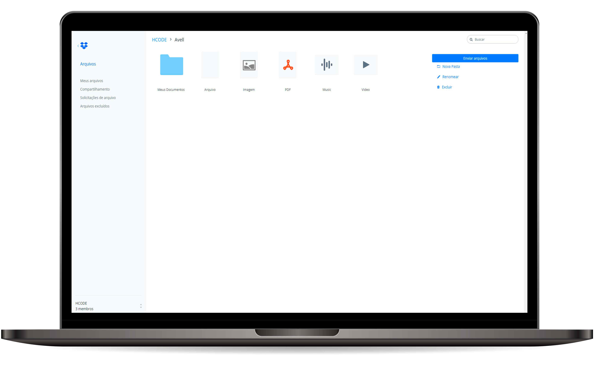

# Dropbox Clone
> Aplicação desenvolvida durante o Curso Completo de JavaScript realizado na Udemy.




## Introdução

Aplicação desenvolvida durante o [Curso Completo de JavaScript](https://www.udemy.com/course/javascript-curso-completo/) ministrado pela [HCode Treinamentos](https://www.hcode.com.br/#/) realizado na [Udemy](https://www.udemy.com/). A Aplicação consiste reproduzir o [Dropbox](https://www.dropbox.com/pt_BR/) com a ideia de ficar o mais semelhante ao software oficial.

Durante a execução deste projeto vale destacar ensinamento como:
 - Express
 - Firebase
 - Upload de arquivos
 - NodeJS

## Pré-requisitos

Para a execução da aplicação será necessario ter instalado em sua máquina:
 - Node.js
 - NPM (Gerenciador de dependências do Node) ou YARN
 - Bower

## Instalação

Será necessario realizar o seguinte comando dentro do diretório ```app``` para a instalação de todas as dependências necessarias:

Caso esteja utilizando NPM:

```sh
npm install
```
Caso esteja utilizando YARN:

```sh
yarn
```

Também é necessario no diretório ```app/public``` executar o seguinte comando para instalar as dependências do Bower:

```sh
npm install -g bower
```
e
```sh
bower install
```

## Execução

Para a execução da aplicação basta realizar o seguinte comando em seu terminal:

Caso esteja utilizando NPM:

```sh
npm start
```
Caso esteja utilizando YARN:

```sh
yarn start
```


## Status do projeto

 - **EM ANDAMENTO**

## Autor

Guilherme Selair – [@GuiSelair](https://github.com/GuiSelair)

## Referência
 Curso ministrado pela empresa [HCode Treinamentos](https://www.hcode.com.br/#/).
